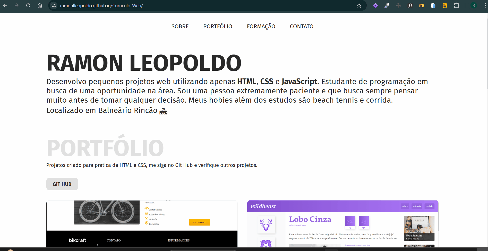
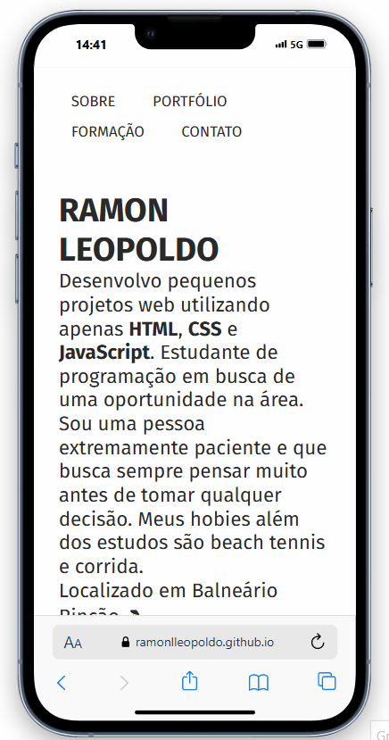

# Curriculo web

Projeto desenvolvido na disciplina de Desenvolvimento Web. Tivemos o desafio de criar um currículo web com o intuito de praticar conceitos básicos de desenvolvimento web.

 

Acesse o projeto clicando <a href="https://ramonlleopoldo.github.io/Curriculo-Web/" target="_blank">AQUI</a> 

### Versão desktop

### Versão mobile

